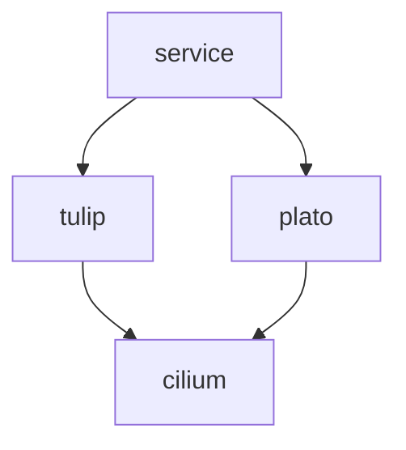

> [!WARNING]  
> This is a work in progress and is not yet ready for production use.

## kreat8s
Kreato's Kubernetes setup

## Setup

### Servers

(This is mostly taken from https://github.com/kreatoo/infra)

* tulip
    * Cloud: OCI (Oracle Cloud Infrastructure)
    * Region: Frankfurt
    * OS: AlmaLinux
    * Kubernetes distro: Plain K8s
    * Role: Control-plane node
    * Machine: VM.Standard.A1.Flex (Ampere Altra) with 4 cores, 12GB RAM, 200GB storage

* plato
    * Cloud: Hetzner Cloud
    * Region: Helsinki
    * OS: Ubuntu 24.04
    * Kubernetes distro: Plain K8s
    * Role: Agent node
    * Machine: CAX11 (Ampere Altra) with 2 cores, 4GB RAM, 40GB storage


### Workload


### Components
* GitHub Actions - Deployment pipeline
* ArgoCD - For GitOps, manages all the deployments (except itself and the CNI)
* Cilium - Load balancer, network policies
* cert-manager - For managing certificates
* Robusta - For alarms and monitoring
* Traefik - Ingress controller
* Nginx-kpkg - for hosting a kpkg repository
* Nextcloud - For file sharing
* Mastodon - For social networking
* Forgejo - For Git repositories


## Installation
The setup assumes you already have Kubernetes installed with a CNI (Tested with Calico, should work in any) and Helm. 

This setup uses Kustomize to manage the manifests. To install the setup, clone the repo and run the following commands:

```bash
kubectl kustomize --enable-helm | kubectl apply -f -
```

Please keep in mind that Robusta is not included in the setup by default as you need to generate values for it. You can generate a config [here](https://platform.robusta.dev/signup?utm_source=docs) and then put it in the robusta/ folder. After that, you can run the command below (or uncomment robusta/ in kustomization.yaml) to install Robusta:

```bash
kubectl apply -k robusta/
```
