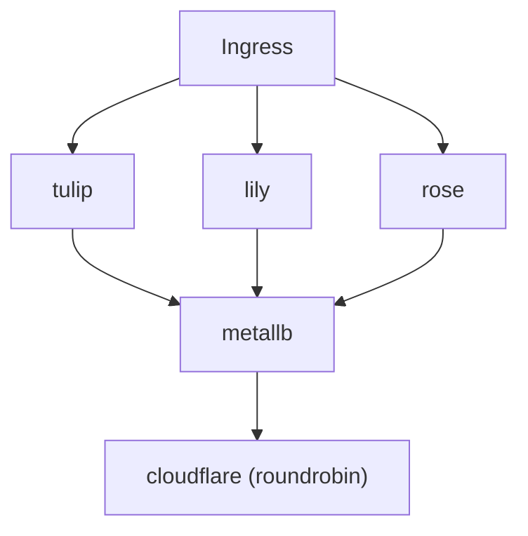

> [!IMPORTANT]
> The cluster has moved to [bouquet2](https://github.com/kreatoo/bouquet2). This repository has been archived.


## bouquet
Kreato's Kubernetes cluster

  


## Setup

### Servers

* tulip
    * Cloud: OCI (Oracle Cloud Infrastructure)
    * Region: Frankfurt
    * OS: AlmaLinux
    * Kubernetes distro: K0s
    * Role: Agent node
    * Machine: VM.Standard.A1.Flex (Ampere Altra) with 4 cores, 24GB RAM, 200GB storage

* rose
    * Cloud: Hetzner Cloud
    * Region: Helsinki
    * OS: Fedora Rawhide
    * Kubernetes distro: K0s
    * Role: Control plane node
    * Machine: CAX31 (Ampere Altra) with 8 cores, 16GB RAM, 160GB storage
 
* lily
    * Cloud: Hetzner Cloud
    * Region: Falkenstein
    * OS: Fedora Rawhide
    * Kubernetes distro: K0s
    * Role: Agent node
    * Machine: CX22 (Intel Xeon) with 2 cores, 4GB RAM, 40GB storage


### Workload


### Components
* GitHub Actions - Deployment pipeline
* Renovate - Dependency updates
* ArgoCD - For GitOps, manages all the deployments (except itself and the CNI)
* MetalLB - Load balancer, network policies
* cert-manager - For managing certificates
* Traefik - Ingress controller
* CloudNativePG - Operator for PostgreSQL which powers most services
* DragonflyDB Operator - Operator for DragonflyDB which powers most memory data stores in services
* Answers - For my own Q&A platform (https://answers.kreato.dev)
* Mastodon - For my own fediverse instance (https://m.kreato.dev)
* Gatus - For health checks (https://status.kreato.dev)
* LiteLLM - For load balancing and caching LLMs
* AI - For my Open WebUI instance (https://ai.kreato.dev)
* Nginx-kpkg - for hosting a kpkg repository (https://bin.kreato.dev)
* k0s - K8s distribution
* Robusta - For alarms and monitoring (optional)
* Forgejo - For Git repositories (Disabled at the moment, optional)

## Installation
The setup assumes you already have Kubernetes installed with a CNI (Tested with Calico, should work in any), Helm and MetalLB. 

This setup uses Kustomize to manage the manifests. To install the setup, clone the repo and run the following commands:

```bash
kubectl kustomize --enable-helm | kubectl apply -f -
```

Please keep in mind that Robusta is not included in the setup by default as you need to generate values for it. You can generate a config [here](https://platform.robusta.dev/signup?utm_source=docs) and then put it in the robusta/ folder. After that, you can run the command below to install Robusta:

```bash
kubectl kustomize --enable-helm robusta/ | kubectl apply --server-side --force-conflicts -f -
```

## Credits
* [mtaha.dev](https://github.com/mt190502) for some ideas
* The Kubernetes image was taken from [Aikoyori's ProgrammingVTuberLogos](https://github.com/Aikoyori/ProgrammingVTuberLogos)
