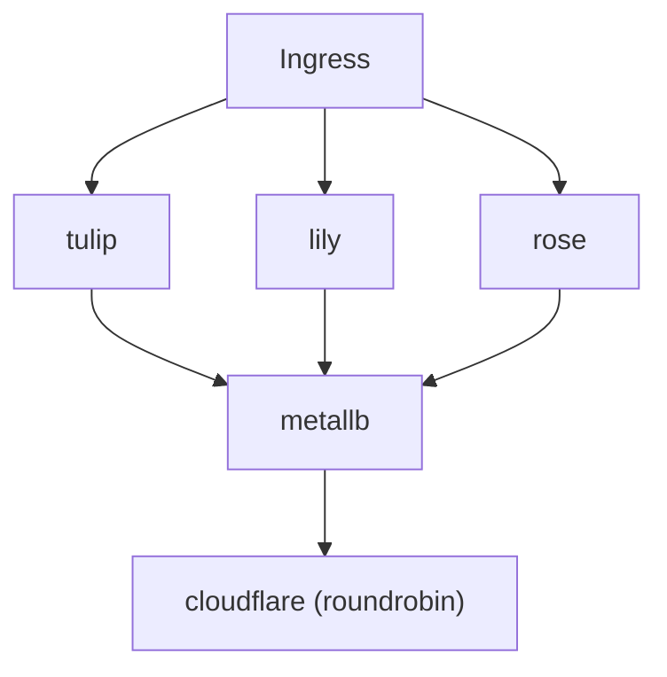

## kreat8s
Kreato's Kubernetes setup

  


## Setup

### Servers

* tulip
    * Cloud: OCI (Oracle Cloud Infrastructure)
    * Region: Frankfurt
    * OS: AlmaLinux
    * Kubernetes distro: K0s
    * Role: Agent node
    * Machine: VM.Standard.A1.Flex (Ampere Altra) with 4 cores, 12GB RAM, 200GB storage

* rose
    * Cloud: Hetzner Cloud
    * Region: Helsinki
    * OS: Fedora 41
    * Kubernetes distro: K0s
    * Role: Control plane node
    * Machine: CAX31 (Ampere Altra) with 8 cores, 16GB RAM, 160GB storage
 
* lily
    * Cloud: Hetzner Cloud
    * Region: Falkenstein
    * OS: Fedora 41
    * Kubernetes distro: K0s
    * Role: Agent node
    * Machine: CX22 (Intel Xeon) with 2 cores, 4GB RAM, 40GB storage


### Workload


### Components
* GitHub Actions - Deployment pipeline
* ArgoCD - For GitOps, manages all the deployments (except itself and the CNI)
* 1Password - For secrets management
* Answers - For my own Q&A platform (https://answers.kreato.dev)
* MetalLB - Load balancer, network policies
* cert-manager - For managing certificates
* Robusta - For alarms and monitoring (Unused at the moment, optional)
* Traefik - Ingress controller
* Nginx-kpkg - for hosting a kpkg repository (https://bin.kreato.dev)
* Nextcloud - For file sharing (Disabled at the moment, optional)
* Forgejo - For Git repositories (Disabled at the moment, optional)
* Gatus - For health checks (https://status.kreato.dev)
* k0s - K8s distribution, has autopilot configured

## Installation
The setup assumes you already have Kubernetes installed with a CNI (Tested with Calico, should work in any), Helm and MetalLB. 

This setup uses Kustomize to manage the manifests. To install the setup, clone the repo and run the following commands:

```bash
kubectl kustomize --enable-helm | kubectl apply -f -
```

Please keep in mind that Robusta is not included in the setup by default as you need to generate values for it. You can generate a config [here](https://platform.robusta.dev/signup?utm_source=docs) and then put it in the robusta/ folder. After that, you can run the command below (or uncomment robusta/ in kustomization.yaml) to install Robusta:

```bash
kubectl apply -k robusta/
```

## Credits
* [mtaha.dev](https://github.com/mt190502) for some ideas
* The Kubernetes image was taken from [Aikoyori's ProgrammingVTuberLogos](https://github.com/Aikoyori/ProgrammingVTuberLogos)
